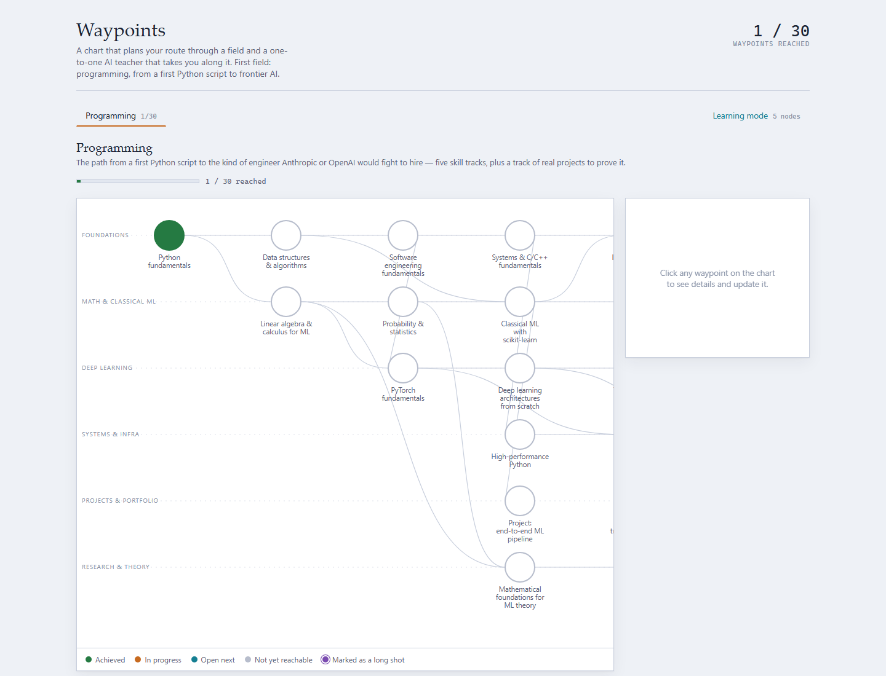

# Waypoints

A full-stack AI tutoring and planning app. A chart plans your route through a
field; a one-to-one AI teacher takes you along it.

The first field is **Programming**: a path from a first Python script to
frontier AI work, drawn as a navigation chart of waypoints. The chart shows
what you've reached, what's open next, and what's a long shot. It is a
reference map rather than a ladder, so any waypoint can be marked out of order.

**Learning mode** then teaches a waypoint. It finds the edge of what you know,
draws a dependency map from there to your goal, and teaches it step by step,
with quizzes, exercises run in real Python, and a session log saved as
Markdown.



## Features

**The chart (planning)**

- 30 waypoints in six parallel lanes (Foundations, Math & Classical ML, Deep
  Learning, Systems & Infra, Projects & Portfolio, Research & Theory), with
  prerequisite edges between them.
- Four states per waypoint (not yet reachable, open next, in progress,
  achieved) plus a separate, personal "long shot" flag.
- Each waypoint carries a skill checklist split into Foundational, Advanced,
  and optional Recall & practice items. Each item has an explainer, a video,
  a course or docs link, practice problems and a mastery project.
- Light "trail map" and dark "star chart" themes.

**Learning mode (tutoring)** — five waypoints so far

1. **Probe** — hand-written seed questions, then adaptive rounds generated by
   Claude until each strand of the topic is bracketed between something you
   got right and something you missed.
2. **Plan** — a dependency map from unconditional truths, through derived
   steps, to your goal. You approve it or send feedback before any teaching.
3. **Teach** — one map node at a time: motivate, establish, connect, then
   quiz checks. A miss triggers a diagnosed re-teach with fresh questions.
4. **Practice and lab** — exercises with assert tests, run in real CPython,
   followed by a code review.

Alongside the lessons there is a chat panel with the teacher (which can see
the current lesson and your answers), figures and Mermaid diagrams that are
checked before they are shown, and a log of every question, answer and lesson
written to `notes/`.

## Running it

You need Python 3.11 or newer and, for the teacher, either
[Claude Code](https://claude.com/claude-code) installed and logged in, or an
Anthropic API key. The chart works without a teacher.

**Windows:** double-click `run.bat`. The first run creates `.venv`, installs
the packages and copies `.env.example` to `.env`; then it opens
http://127.0.0.1:8000.

**macOS / Linux:**

```bash
python3 -m venv .venv
.venv/bin/pip install -r requirements.txt
cp .env.example .env
.venv/bin/python -m uvicorn app.main:app --host 127.0.0.1 --port 8000
```

### Choosing the teacher

Set `TEACHER` in `.env`:

| Value | Uses | Notes |
|---|---|---|
| `claude_code` (default) | Your Claude subscription, through `claude -p` | No API key. Each request is a short Claude Code session with no file or shell tools, in an empty folder. |
| `api` | An Anthropic API key, pay per use | Set `ANTHROPIC_API_KEY`. Streaming, structured outputs, prompt caching, server-side web search. |

Model and effort per task type (quick, default, complex) are also set in `.env`.

## How it's built

```
web/index.html         the whole page: chart, data, Learning mode (vanilla HTML/CSS/JS, no build step)
web/local-runtime.js   the page's storage / teacher / Python calls, backed by the server
app/main.py            FastAPI routes and the local-only guard
app/store.py           JSON documents in SQLite (data/waypoints.db)
app/runner.py          runs learner code in CPython
app/teacher/           the two teacher routes behind one interface (base.py)
tests/                 server tests and the seed-question checker
```

| Route | Purpose |
|---|---|
| `GET /api/docs/{collection}`, `PUT /api/docs/{collection}/{id}` | Saved progress |
| `POST /api/ask` | One teacher request, streamed back as NDJSON (`delta`, `done`, `error`) |
| `POST /api/run` | Run Python and return its output |
| `POST /api/notes/{name}` | Write a session log to `notes/` |
| `GET /api/status`, `GET /api/limits` | Teacher readiness and usage |

### Design decisions

- **The API can run code, so only the app's own page may call it.** The
  server listens on 127.0.0.1 only, rejects any request whose `Host` header
  isn't the local address (which stops DNS rebinding), and requires a custom
  `X-Waypoints` header on every write, which another website can't send
  without a CORS preflight the server never approves.
- **Learner code runs in a separate CPython process**: isolated mode (`-I`),
  a throwaway working folder, a trimmed environment, a 10-second limit and an
  output cap. This guards against runaway code. It is not a sandbox: the code
  has the same access as any script you run yourself.
- **Quiz answer keys are checked, not trusted.** Questions about what code
  prints are run in real Python, and a generated question is thrown away if
  the output doesn't match its key. The hand-written seeds get the same check
  in the tests.
- **A missing visual beats a wrong one.** Mermaid diagrams that don't parse
  are dropped. Generated SVG figures are sanitized, measured in the browser
  for cut-off or overlapping labels, repaired once, and otherwise left out.
- **Structured replies.** JSON tasks send a JSON Schema, and the page still
  re-validates the content of quizzes and plans.
- **One HTML file, no build step,** to keep iteration fast.

## Tests

```
.venv\Scripts\python -m unittest discover tests
node tests/check_learn_seeds.js .venv/Scripts/python.exe
```

The first starts the real server on a spare port with a temporary database
and notes folder, and checks storage, the Python runner (output, errors,
timeout, output cap), the security guards, notes and the page. It makes no
teacher calls. The second checks every Learning-mode seed question, including
running the output-based answer keys against CPython (needs Node.js).

## Data and privacy

Everything stays on your computer: progress in `data/waypoints.db`, session
logs in `notes/`. Both are git-ignored, along with `.env`. Lesson content is
sent to Claude through whichever teacher route you chose. The page loads
marked, DOMPurify, CodeMirror and Mermaid from cdnjs.

## Roadmap

Programming is the only field for now. The aim is a tutoring and planning app
for any field, which needs:

- Learning mode for the remaining Programming waypoints (C/C++, PyTorch and
  others need a runner beyond standard-library Python).
- Charts for other fields, and practice that isn't code.

## Acknowledgements

Learning mode's structure and teaching philosophy (probe, plan, teach;
unconditional truths first; "how could I have discovered this?") are inspired
by Amos Blomqvist's [learn](https://github.com/amosblomqvist/learn). The
implementation here is separate.

Built with [Claude Code](https://claude.com/claude-code); `CLAUDE.md` is the
running design log.

## Licence

[MIT](LICENSE)
